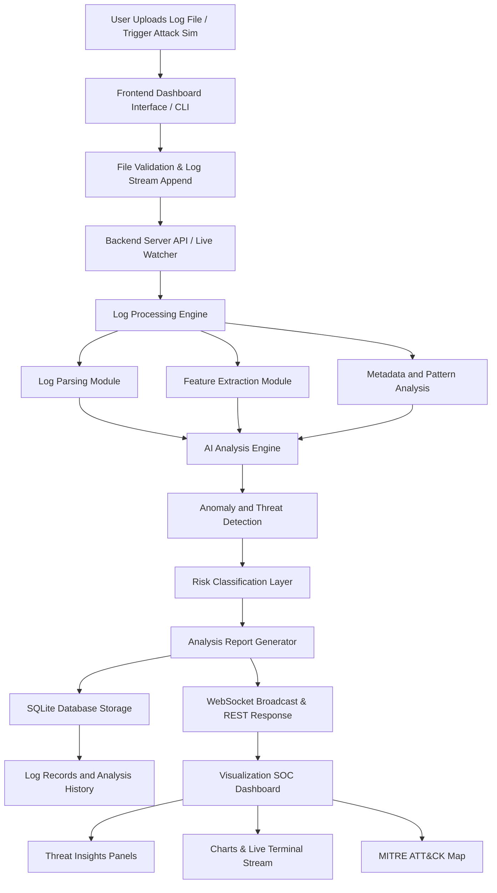

# 🔐 AI CyberLog Analyzer - CyberGuard SOC Dashboard

<p align="center">
  
  
  
  
  
</p>

---

## 🛡️ Project Overview

**AI CyberLog Analyzer (CyberGuard)** is a futuristic SOC (Security Operations Center) style cybersecurity dashboard that analyzes log files, detects suspicious activities, and visualizes threats in real-time using an eye-catching, glassmorphism cyber-themed interface.

It supports multi-format log parsing, rule-based threat detection mapped to the MITRE ATT&CK framework, and **real-time live monitoring** powered by WebSockets.

---

## ✨ Features

### 📡 Real-Time Live Monitoring & Streaming
- **WebSocket-Based SOC Feed**: Live stream Apache-style access logs directly into a terminal-style UI at `/stream`.
- **Live Threat Detection**: A real-time watcher detects threat patterns as they are generated and pushes them directly to the frontend's **Live Detections** panel.
- **Active Attack Simulator**: Includes a CLI tool (`npm run attack:demo`) to run simulated attacks (Brute Force, DDoS, SQL Injection, Port Scanning, etc.) and observe live detections.

### 📤 Core Log Analysis
- **Smart Log Upload**: Drag & drop support for `.log`, `.txt`, `.json`, and `.csv` files.
- **AI Anomaly Detection**: Hybrid heuristics-based detection engine paired with natural-language AI threat summaries and risk scoring.
- **MITRE ATT&CK Mapping**: Automatically maps detected threats to the official MITRE ATT&CK techniques with visual threat badges.
- **SOC Analytics Dashboard**: Interactive charts (Recharts) visualizing unique IPs, logs processed, threat severity breakdown, and recent threat event tables.

### 🎨 Premium Cyber-Dark UI/UX
- Futuristic dark theme (`#0A0F1F`) with neon glow accents.
- Smooth animations powered by **Framer Motion**.
- Fully responsive layout for desktop and tablet screens.

---

## 🔷 System Architecture



---

## ⚙️ Threat Detection Engine & MITRE Mapping

The detection engine classifies threat activity under corresponding **MITRE ATT&CK** techniques:

| Threat Type | Rule Criteria | MITRE ID | Description |
| :--- | :--- | :--- | :--- |
| **Brute Force Attack** | >5 failed login attempts from a single IP in 60s | `T1110` | Credential guessing attempt |
| **DDoS Pattern** | >100 HTTP requests in 60s from a single IP | `T1498` | Network denial-of-service attempt |
| **Exploit Attempt** | Detection of SQLi, XSS, or path traversal payloads | `T1190` | Exploitation of public-facing application |
| **Reconnaissance** | Port probing or directory/service scanning | `T1046` | Active network scanning |
| **Unauthorized Access** | Clusters of 401/403 unauthorized client errors | `T1078` | Attempted valid accounts abuse |
| **Suspicious Tool** | User-agent headers matching Nikto, sqlmap, or Nmap | `T1595` | Active scanner scanning |

---

## 📂 Project Structure

```text
cyber-log-analyzer/
├── client/                    # React Frontend (Vite)
│   ├── src/
│   │   ├── components/        # Layout, Sidebar, ThreatBar (live alert sidebar)
│   │   ├── pages/             # Dashboard, Upload, LogStream, Analysis, MitreAttack
│   │   ├── hooks/             # WebSocket connections
│   │   ├── utils/             # API client configurations
│   │   ├── App.jsx            # Routing and paths
│   │   ├── index.css          # Theme design tokens & utilities
│   │   └── main.jsx
│   ├── vite.config.js         # Proxy rules pointing /api and /ws to port 5000
│   └── package.json
├── server/                    # Node.js Express Backend
│   ├── routes/
│   │   ├── logs.js            # REST API endpoints
│   │   └── demo.js            # Live simulation controls
│   ├── services/
│   │   └── demoTraffic.js     # Simulated logs and attack generator
│   ├── db.js                  # SQLite schema creation & seed data
│   ├── liveMonitor.js         # Log file tailing & parser trigger
│   ├── index.js               # Express app and WebSocket server config
│   └── package.json
├── parser/                    # Analysis Core
│   ├── logParser.js           # Multi-format (JSON, CSV, Raw Log) parsing engine
│   ├── detectionEngine.js     # Heuristic detection rule list
│   └── aiAnalyzer.js          # Mock LLM insights & risk score generator
├── websocket/
│   └── streamManager.js       # WebSocket broadcasting & subscriber manager
├── database/
│   ├── schema.sql             # SQL references
│   └── sample.log             # Test logs
├── scripts/
│   └── attack-simulator.js    # Interactive attack CLI tool
├── package.json               # Main orchestration package script
└── README.md
```

---

## 🚀 Installation & Setup

### Prerequisites
- **Node.js** (v20.x or higher)
- **npm** (v10.x or higher)

### Setup Instructions

1. **Clone the Repository** and navigate to the project directory:
   ```bash
   cd AI-CyberLog-Analyzer-Live-Monitering--
   ```

2. **Install Dependencies**:
   Installs root dependencies and triggers nested package setups for client & server folders:
   ```bash
   npm install
   ```
   *(Note: SQLite and native extensions will automatically compile and build for your active Node version).*

3. **Configure Environment Variables**:
   Create a `.env` file in the root directory (you can copy `.env.example`):
   ```bash
   cp .env.example .env
   ```

4. **Run the Project**:
   Launches both the backend server and frontend development client concurrently:
   ```bash
   npm run dev
   ```

   - **Frontend UI**: `http://localhost:5173/`
   - **Backend Server**: `http://localhost:5000/`

---

## 🔬 Testing the Live SOC Monitoring Demo

1. **Open the Dashboard Live Stream Page** in your browser:
   `http://localhost:5173/stream`
2. **Launch the Attack Simulator** in a separate terminal:
   ```bash
   npm run attack:demo
   ```
3. **Choose an Attack Type** or run a continuous simulation from the interactive CLI:
   - `1` — Brute Force Attack
   - `2` — SQL Injection (Exploit)
   - `3` — Port Scanning (Reconnaissance)
   - `4` — DDoS Pattern
   - `5` — Mixed Attack Simulation
4. **Watch the live terminal feed** at `/stream` and the **Live Detections** panel capture, classify, and map the threats to MITRE ATT&CK techniques in real time!
