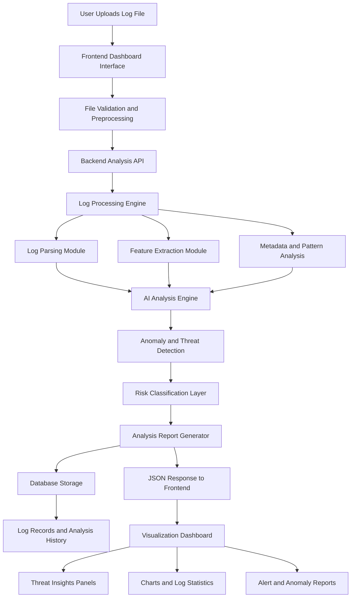

# 🔐 AI CyberLog Analyzer - CyberGuard SOC Dashboard

<p align="center">
  
  
  
  
  
</p>

------------------------------------------------------------------------

## 🛡️ Project Overview

**AI CyberLog Analyzer (CyberGuard)** is a futuristic SOC (Security
Operations Center) style cybersecurity dashboard that analyzes log
files, detects suspicious activities, and visualizes threats in
real-time using an eye-catching cyber-themed interface.

It is designed for: - 🔵 Blue Team Learning - 🛰️ SOC Dashboard
Simulation - 📊 Log Intelligence & Threat Detection - 🔐 Cybersecurity
Portfolio Projects

The system supports multi-format log parsing, AI-driven insights, MITRE
ATT&CK mapping, and real-time cyber threat visualization.

------------------------------------------------------------------------

# 🔷 System Architecture Diagram

------------------------------------------------------------------------

# ⚙️ Detailed System Workflow

## 1️⃣ Log Input Layer

Users can upload logs in multiple formats: - `.log` - `.txt` - `.json` -
`.csv` - Apache/Nginx access logs

OR use live stream simulation for real-time SOC experience.

------------------------------------------------------------------------

## 2️⃣ Frontend --- CyberGuard Dashboard

Built using: - React + Vite - Tailwind CSS (Cyber Theme) - Recharts
(Data Visualization) - Framer Motion (Animations)

Main Modules: - Dashboard (Threat Analytics) - Upload Logs Panel - Live
Stream Viewer - AI Analysis Section - MITRE ATT&CK Mapping Panel -
Recent Analysis Sessions

------------------------------------------------------------------------

## 3️⃣ Backend Processing (Node.js + Express)

The backend handles: - Secure file uploads - REST API communication -
Log analysis orchestration - Real-time data processing - Threat
detection routing

------------------------------------------------------------------------

## 4️⃣ Log Parsing Engine (Core Intelligence)

The parser extracts key attributes: - Timestamp - IP Address - Event
Type - Status Codes - Users & Endpoints

Detection Methods: - Regex pattern matching - Frequency analysis -
Behavioral correlation - Event classification

------------------------------------------------------------------------

## 5️⃣ Threat Detection Engine (Blue-Team Logic)

Detects: - 🔴 Brute Force Attacks (Multiple failed logins) - 🟠
Credential Stuffing - 🟡 Unauthorized Access (401/403) - 🟣 DDoS
Patterns (Request spikes) - 🔵 IP Anomalies - ⚠️ Privilege Escalation
Attempts

Example Rule: IF failed_logins_from_same_IP \> 5 within 60 seconds\
→ Flag as Brute Force Attack (HIGH Severity)

------------------------------------------------------------------------

## 6️⃣ AI Analysis Module

Provides intelligent insights: - Automated threat summaries - Risk
scoring - Behavior explanation - Human-readable cyber analysis

Example Output: "Possible brute force attack detected from IP
185.243.44.12 with multiple failed login attempts within a short time
window."

------------------------------------------------------------------------

## 7️⃣ Database Layer (SQLite)

Why SQLite: - No external DB setup - Lightweight & portable -
Auto-created on first run - Perfect for GitHub cloning - No MongoDB / No
Supabase

Stored Data: - Uploaded Logs - Threat Results - Analysis Sessions - IP
Activity Metrics

------------------------------------------------------------------------

## 8️⃣ Visualization & SOC Dashboard Output

Displayed Analytics: - Threat Severity Pie Chart - Top IP Activity
Graph - Threat Breakdown Chart - Unique IP Counter - Logs Processed
Counter - Recent Threat Table

------------------------------------------------------------------------

# 🔍 MITRE ATT&CK Mapping

| Attack Type           | MITRE ID | Description                     |
|-----------------------|----------|---------------------------------|
| Brute Force           | T1110    | Credential Guessing             |
| Unauthorized Access   | T1078    | Valid Accounts Abuse            |
| DDoS Pattern          | T1498    | Network Denial of Service       |
| Privilege Escalation  | T1068    | Exploitation for Privilege      |

------------------------------------------------------------------------

# 🚀 Installation (Clone & Run)

``` bash
cd AI-CyberLog-Analyzer
npm install
npm run dev
```

⚡ SQLite database auto-generates on first run (Zero configuration
required)

------------------------------------------------------------------------

## ✨ Features

### Core Functionality
- **📤 Smart Log Upload** — Drag & drop `.log`, `.txt`, `.json`, `.csv` files with preview
- **📡 Real-Time Streaming** — WebSocket-based SIEM-style live log feed with terminal UI
- **🧠 AI Anomaly Detection** — Rule + heuristic hybrid engine with natural-language summaries
- **🛡️ MITRE ATT&CK Mapping** — Auto-map threats to framework techniques with visual badges
- **📊 Interactive Analytics** — Recharts-powered dashboards with pie, bar, and line charts

### Detection Engine (Blue-Team Logic)
| Threat Type | Description | MITRE ID |
|---|---|---|
| Brute Force Attack | >5 failed logins from same IP in 60s | T1110 |
| DDoS Pattern | >100 requests/min from single IP | T1498 |
| Exploit Attempt | SQL injection, XSS, path traversal | T1190 |
| Reconnaissance | Directory/service scanning | T1046 |
| Unauthorized Access | Repeated admin panel probing | T1133 |
| Suspicious Tool | Known scanner user-agents (Nikto, sqlmap, Nmap) | T1595 |
| Auth Failures | Clusters of 401/403 responses | T1078 |

### UI/UX
- 🌑 Futuristic cyber-dark theme (#0A0F1F)
- ✨ Neon glow accents (cyan, purple, blue)
- 🔲 Glassmorphism cards with backdrop blur
- 🎬 Framer Motion animations throughout
- 📟 Terminal-style live log viewer
- 📱 Fully responsive design

------------------------------------------------------------------------

# 📂 Project Structure

```text
cyber-log-analyzer/
├── client/                    # React Frontend
│   ├── src/
│   │   ├── components/        # Layout, Sidebar, ThreatBar
│   │   ├── pages/             # Dashboard, Upload, LogStream, Analysis, MitreAttack
│   │   ├── hooks/             # useWebSocket custom hook
│   │   ├── utils/             # Axios API client
│   │   ├── App.jsx            # Router + routes
│   │   ├── main.jsx           # Entry point
│   │   └── index.css          # Global styles + cyber theme
│   ├── tailwind.config.js     # Custom theme config
│   ├── vite.config.js         # Vite + proxy config
│   └── package.json
├── server/                    # Express Backend
│   ├── routes/
│   │   └── logs.js            # API endpoints
│   ├── db.js                  # SQLite setup + MITRE seeding
│   ├── index.js               # Server entry point
│   └── package.json
├── parser/                    # Detection Engine
│   ├── logParser.js           # Multi-format log parser
│   ├── detectionEngine.js     # 7 threat detection rules
│   └── aiAnalyzer.js          # AI analysis + risk scoring
├── websocket/
│   └── streamManager.js       # WebSocket + simulated stream
├── database/
│   ├── schema.sql             # Reference SQL schema
│   ├── sample.log             # Test log file
│   └── logs.db                # Auto-generated SQLite DB
├── .env.example               # Environment template
├── .gitignore
├── package.json               # Root scripts
└── README.md
```

------------------------------------------------------------------------

## 🧱 Tech Stack

| Layer | Technology | Purpose |
|---|---|---|
| Frontend | React 18 + Vite | Fast development & build |
| Styling | Tailwind CSS | Utility-first cyber theme |
| Animations | Framer Motion | Smooth micro-interactions |
| Charts | Recharts | Interactive data visualization |
| Icons | Lucide React | Consistent icon system |
| Backend | Node.js + Express | REST API server |
| Real-time | WebSocket (ws) | Live log streaming |
| Database | SQLite (better-sqlite3) | Zero-config portable DB |
| Security | Helmet + Rate Limiter | API hardening |

------------------------------------------------------------------------

# 🔐 Security & Performance

-   Secure file validation
-   Async log parsing (high performance)
-   Large log file support
-   Modular scalable architecture
-   Robust error handling

------------------------------------------------------------------------

# 🌟 Future Enhancements

-   Real-time WebSocket Log Streaming
-   AI Threat Explanation (LLM Integration)
-   PDF Threat Report Export
-   Geo-IP Visualization Map
-   Machine Learning Anomaly Detection
-   Alert Notification System
